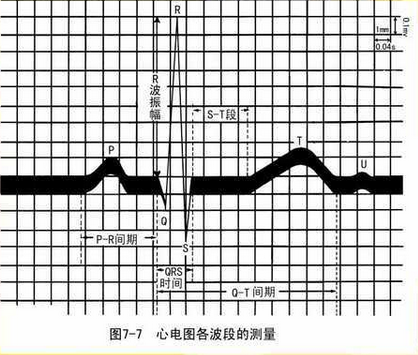
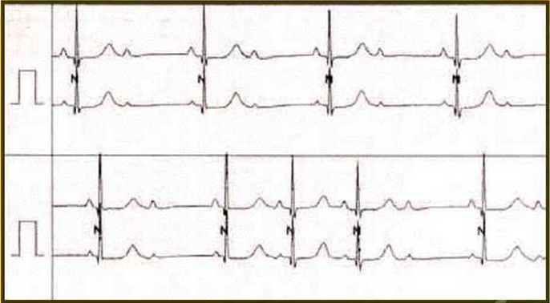

# 心电图基础教程

*Clément édite à 1.11.2016*

## 心电图基本知识

心电图(ECG)：是利用心电图机通过导线与体表相连，记录心脏在每个心动周期所产生的电活动变化的曲线图形。

### 心电图导联与导联轴

心电图导联：是将电极放置于人体表面任何两点，并通过导线分别与心电图机正负极相连，这种记录心电图的电路连接方法称为心电图导联。

##### 常用的心电图导联：12个。

标准肢体导联3个：I、II、III

加压单极肢体导联3个：aVR、aVL、aVF

胸导联6个：V1、V2、V3、V4、V5、V6

导联轴：某一导联正、负电极之间画出的假想直线，称为该导联的导联轴。

##### 心电图各波段的组成及命名

一个完整的心动周期所描记的心电图包括：

四个波：P波、QRS综合波、T波、U波；

两个间期：PR间期、QT间期；

一个段：ST段。

 

P波：心房除极波，反映心房除极时的电位、时间和方向的变化。

P-R间期：反映心房除极开始到心室除极开始的时间。

QRS波群：心室除极波，反映心室肌除极的电位、时间和方向的变化。

ST段：反应心室除极刚刚结束后尚处在缓慢复极的一段时间。

T波：反映心室快速复极时的电位变化。

QT间期：反映心室肌除复极全过程所需要的时间。

R波：QRS波群在等电位线上的第一个向上的波。

Q波：R波之前向下的波。

S波：R波之后向下的波。

R'波：S波之后出现再向上的波。

S'波：R'波之后再有向下的波。

QS波：整个QRS波群均向下时。

**书写表示法**：振幅（波形）较大者用大写英文字母表示，较小者用小写英文字母表示。

 

国产心电图机导联线的连接：黄色(L)接左上肢，红色(R)接右上肢，绿色(F)接左下肢，黑色(RF)接右下肢；白色导线(V)为胸导联线，将导联线的吸杯电极分别与V1、V2、V3、V4、V5、V6的位置相连。

## 正常心电图

### 心电图的测量与分析

##### 心电图记录纸

*横向*代表时间，每小格等于0.04s;

*纵向*代表电压(振幅)，每小格相当于0.1mV。

##### 心率计算

心律规则时：心率=60/R-R(或P-P)间期，如：R-R间期为0.8s，则心率为60/0.8=75次/分钟。

心率不规则：则需要测量同一导联5个以上的R-R(或P-P)间期，取其平均值，代入上述公式，计算出心率。

##### 各波段振幅的测量

正向波的高度：自水平线的上缘垂直测至波形顶点。

负向波的深度：自水平线的下缘垂直测至波形底端。

双向波：上下振幅的绝对值之和为其电压数。

##### 心电图各波段的测量

 

##### 心电轴(?)

#### 心电图各波段正常值

 

##### P波

形态：正常P波形态在大部分导联上成圆钝形，有时可有轻度切迹。P波方向在I、II、aVF、V4~V6导联向上，aVR导联向下，其余导联呈双向、倒置或低平。

时间：一般小于0.12s。

电压：肢体导联一般小于0.25mV，胸导联一般小于0.2mV。

##### Ptfv1

$$ Ptfv_1 > -0.04mm \cdot s$$

##### P-R间期

从P波的起点到QRS波群的起点。P-R间期与心率快慢有关，成年人心率在60~100次/分钟，P-R间期为0.12~0.20s。

##### QRS波群

时间：正常成年人QRS波群时间小于0.12s，多数为0.06~0.10s。

波形与振幅(电压)

* 胸导联：一般规律是$$R_{V1}$$~$$R_{V5}$$逐渐增高，而S波逐渐减小。$$V_1,V_2$$导联多呈rS形，R/S\<1，$$R_{V1}$$不超过1.0mV。$$V_5,V_6$$导联QRS波群可以呈qR, qRs, Rs或R形，R/S \>1, $$R_{V5}$$不超过2.5mV。$$V_3$$或$$V_4$$导联多呈RS形，R/S大致等于1。
* q肢体导联：标准导联一般主波向上，I导联的R波不超过1.5mV。aVR导联QRS波群主波向下，可呈QS、rS、rSr'或Qr形，aVR导联的R波一般不超过0.5mV。aVL与aVF导联的QRS波群可呈qR、Rs、R形。也可呈rS形，aVL导联的R波不超过1.2mV，aVF导联的R波不超过2.0mV。
* Q波：除aVR导联外，正常Q波时间一般小于0.04s,振幅小于同导联R波的1/4。

##### 低电压

6个肢导联：QRS波群正向波与负向波振幅的绝对值相加不应小于0.5MV

6个胸导联：QRS波群正向波与负向波振幅的绝对值相加不应小于0.8MV

**否则为低电压**

##### VAT

R峰时间：或室壁激动时间是指QRS波群的起点至R波顶端垂直线的距离

V1、V2不超过0.04s，V5、V6不超过0.05s。

##### S-T段

* 正常S-T段为一等电位线，可以有轻微的向上或向下移位。
* S-T段下移：在任何导联中，S-T段下移不应超过0.05mV。
* S-T段抬高：在V1、V2导联不应超过0.3mV，V3导联不应超过0.5mV,V4~V6导联和肢体导联均不应超过0.1mV。

##### T波

正常时T波圆钝，两支不对称。T波正向时，升支长于降支，T波负向时，降支长于升支。
方向：正常T波方向与QRS波群主波方向一致，即I、II、V4\~V6导联T波向上，aVR导联向下，III、aVL、aVF、V1\~V3导联T波可以向上、向下或双向。如果V1导联T波向上，V2~V6导联T波均不应向下。
振幅：在以R波为主的导联中，T波振幅不应该低于同导联R波的1/10。胸导联T波可达1.2~1.5mV。

##### Q-T间期及U波

Q-T间期：其长短与心率快慢有密切关系，心率快时，Q-T间期缩短；心率慢时，Q-T间期延长。心率在60\~100次/分钟时，Q-T间期的范围在0.32~0.44s。为了避免受心率影响，常用校正的Q-T间期，即 $ Q-Tc= \frac{Q-T}{\sqrt{R-R}} $ 。Q-Tc就是R-R间期为1s(心率60次/分)时的Q-T间期，正常Q-Tc不超过0.44s，一般女性的Q-Tc间期较男性略长。

U波：是T波之后0.02~0.04s出现的振幅很低小的波，方向与T波相同。以V3~V4导联较明显。U波过高者见于低血钾病人。

### 心电图的分析方法与临床应用

##### 分析方法

   全面的一般性阅读;

* 计算心率；
* 判定心电轴方向；
* 观察和测量波形；
* 做出诊断；

##### 临床应用

确定诊断，协助诊断。

## 常见异常心电图

心房、心室肥大

心肌梗死

心率失常

##### 右心房肥大

右心房肥大心电图P波高尖，又称为“肺型P波”，肢体导联P波电压$$\geq $$ 0.25mV, II、III、aVF导联表现最明显。

##### 左心房肥大

左心房肥大心电图P波增宽且常呈双峰型，又称为“二尖瓣型P波”。I、II、aVR、aVL导联P波增宽，P波时间$$\geq $$ 0.12s，P波顶端常有切迹呈双峰状，两峰间距$$\geq $$ 0.04s。

##### 左心室肥大

QRS波群高电压

胸导联：$$ R_{V_5}>2.5mV; R_{V_5}+S_{V_1}>4.0mV$$(男)或>3.5mV(女)。

肢体导联：$$R_I>1.5mV; R_{aVL}>1.2mV; R_{aVF}>2.0mV; R_I + R_{III}>2.5mV$$。

心电轴左偏。

QRS波群时间延长：0.10~0.11s，一般仍\<0.12s。

ST-T改变：以R波为主的导联，ST段可呈下斜型压低达0.05mV以上，T波低平、双向或倒置。在以S波为主的导联（如V1导联）则可见直立的T波。当QRS波群电压增高且伴有ST-T改变时，称为左心室肥大伴劳损。

##### 右心室肥大

右心室高电压：V1导联中$$R/S \geq 1, $$ V5导联中R/S $$\leq 1$$或S波比正常加深；aVR导联中R/S或R/Q $$\geq 1$$。$$R_{V1}+S_{V5}\>1.05mV$$(重症>1.2mV); $$R_{aVR}\>0.5mV$$。

心电轴右偏$$\geq 90^\circ $$ 。

ST-T改变：右胸导联$$(V_1,V2)$$ST段压低，T波倒置，称右心室肥大伴劳损。

#### 心肌梗死

##### 心肌梗死的基本图形

 

缺血型改变：T波高耸直立；心肌缺血发生在心外膜时，表现为T波倒置。

损伤型改变：ST段逐渐抬高，并与高耸的T波相连，融合成弓背向上高于基线的单向曲线。

坏死型改变：异常的Q波或QS波。

##### 心肌梗死的图形演变及分期

早期：表现为巨大、高耸的不对称的T波，ST段呈斜上型抬高。

急性期：表现为ST段继续抬高，凸面向上，呈弓背状，常可见到“单向曲线”，出现病理性Q波。继而ST段逐渐下降，T波开始倒置。

亚急性期：抬高的ST段逐渐降至基线，坏死型Q波继续存在，倒置的T波逐渐变浅，直至恢复正常或恒定不变。

陈旧期：心肌梗死后3~6个月，ST-T波不再变化，只存留坏死性Q波。

 

##### 心肌梗死定位诊断

 

### 心率失常

#### 缓慢性心律失常

##### 正常窦性心律

P波的方向：P I、II、AVF、V4-V6直立，P aVR倒置

PR间期：0.12-0.20s

PP间期：PP间期的互差\<0.12s

频率：60-100次/分

 

##### 窦性心动过缓(sinus bradycardia)

P波的方向：P II直立，P aVR倒置

PR间期：0.12-0.20s

频率：\<60次/分，但很少\<40次/分

可伴有窦性心律不齐，结性逸博等

特征：窦性P波频率\<60次/分。常伴有窦性心律不齐 

##### 窦性心律不齐

P波的方向：P II直立，P aVR倒置

PR间期：0.12-0.20s

P-P间期差异： \>0.12s

常伴有窦性心律过缓

呼吸性窦性心律不齐常见

##### 窦性心动过缓及窦性心律不齐 

具有窦性心律的特点。

心率在60次/分以下，一般不低于40次/分。

窦性心律不齐：窦性心律快慢显著不等，在同一导联上P-P间期相差\>0.12s。常与呼吸周期有关，吸气时心率稍快，呼气时心率稍慢。 

##### 窦性停搏

特征：在规律的窦性P-P中，突然有一长间歇无P波(常>2s),长的P-P与短的P-P不成倍数关系间歇过长时可能出现交界性逸搏，室性逸搏

 

#### 传导阻滞

传导阻滞的分类

1. 一度传导阻滞：传导延缓
2. 二度传导阻滞：部分激动传导脱落
3. 三度传导阻滞：传导完全中断

##### 窦房传导阻滞

定义：存在于窦房结和心房之间的传导阻滞

特点：常规心电图不能记录窦房结动作电位，只能通过分析P波的规律进行推断

##### 一度窦房传导阻滞(传导延缓)

每一次窦房结的电活动都产生窦性P波，节律基本整齐。体表ECG无法诊断。

##### 三度窦房传导阻滞(传导完全中断)

窦性P波消失，与持续窦性静止无法鉴别

##### 二度窦房传导阻滞

I型：P-P间期逐步缩短，然后突然延长，周而复始，最长P-P小于2倍最短P-P

II型：短P-P间期规则。有长P-P间期，长P-P间期与短P-P间期有倍数关系

##### 房室传导阻滞(A-V block)

房室传导阻滞(AVB)是指房室之间的传导障碍。可发生于房室结、希氏束或左右束支

按严重程度分：I度AVB:房室传导延缓但无脱落；II度AVB:有部分心房激动不能传入心室；III度AVB:又称完全性房室传导阻滞，所有心房激动均不以传入心室

1. 一度房室传导阻滞
2. 二度房室传导阻滞
   * 二度I型房室传导阻滞
   * 二度II型房室传导阻滞
3. 三度房室传导阻滞

##### 一度房室传导阻滞

PR间期持续\>0.21s

PR间期虽未超过正常范围，但心率变或较快时，PR间期较原先延长0.04s

 

特征：P-R间期超过正常最高值(正常P-R间期的长短与心率年龄有关)，一般>0.20s

##### 二度房室传导阻滞

定义：部分P波后有QRS波脱落

分类：

- 二度I型房室传导阻滞(Morbiz I形)
- 二度II型房室传导阻滞(Morbiz II形)

二度I型房室传导阻滞

文氏现象

* P-R间期逐渐延长，直至发生QRS脱落
* P-R间期逐渐缩短
* 长的RR间期短于两个短RR间期之和
* QRS波群时间、形态一般正常(除非合并室内传导异常)
* 房室传导比例一般>2:1 比如 3:2, 4:3等

 

特征：P-R间期逐渐延长，直至脱落一个QRS波群后，P-R间期缩短，继之又延长，周而复始

典型表现：PR间期逐渐延长，RR间期逐渐缩短，QRS波群周期性脱落

二度II型房室传导阻滞

* 在QRS 漏搏之前，PR间期恒定
* RR间期无明显变化
* 长的RR间期为短RR间期的整数倍
* 房室传导比例一般为2:1,3:1等
* 连续出现2次以上的脱落称为高度房室传导阻滞 

 

特征：P-R间期固定，P波呈比例脱落，下传的QRS波群正常

二度I型和II型的比较

 

##### 三度房室传导阻滞(交界性心律)

特征：

1.P-P间期相等，R-R间期相等

2.P波与QRS波群无固定时间关系(P-R间期不等)

3.心房率快于心室率(P-P间期\<R-R间期)

4.QRS波群正常(提示心室起搏点在房室交界区)

 

典型表现：

1.P波与QRS波群无关，P波频率(60bpm)\>QRS频率， PP间隔与RR间隔各自规则

2.QRS波群时间，形态正常，为交界区逸博心率

#### 束支与分支传导阻滞

1. 右束支传导阻滞
2. 左束支传导阻滞
3. 左前分支传导阻滞
4. 左后分支传导阻滞

##### 右束支传导阻滞

1. 右束支细长，单侧冠状动脉供血
   * 传导阻滞常见
2. 病因
   * 各种器质性心脏病
   * 也常见于正常人
3. 特征
   * QRS波群前半部接近正常
   * QRS波群后半部延缓，形态变化
4. 心电图特征：
   * QRS时间延长
     * 完全性者QRS$$ \geq$$ 0.12s
     * 不完全者QRS< 0.12S
   * v1呈rSR'型或M形波(最具特征性)
   * S波宽钝而不深
     * 见于V5，V6，I及avL导联
   * V1导联R峰时间延长，>0.05s
   * 常见电轴右偏
   * 不完全性右束支传导阻滞：
     * 有以上QRS波群的特点
     * QRS波群时间成人在0.08-0.12s

 

 

##### 左束支传导阻滞

1. 左束支双侧冠状动脉供血，不易阻滞
2. 病因：多为器质性心脏病
3. 特征：QRS主波(R波与S波)增宽、粗钝或切迹
4. 心电图特征：

* 完全性左束支传导阻滞：QRS$$ \geq$$ 0.12s
* V5或V6 R波增宽，顶端粗钝或切迹
* V1，V2导联S波宽钝
* 电轴可左偏
* ST-T的方向与QRS波的主波方向相反
* V5和V6导联R峰时间延长
  * 成人>0.06s
  * 小儿>0.04s
* 不完全性左束支传导阻滞：

具有以上QRS波群的特点，但QRS波群时间成人在0.08-0.12s，小儿在0.08-0.10s

 

左束支传导阻滞+一度窦房传导阻滞

 

左前分支阻滞

1. 电轴显著左偏> -$$45^o$$具有肯定价值
2. I、avL导联呈qR型，且R avL>R I
3. II、III、AVF呈rS型，且S III>S II
4. QRS时间一般不明显增宽
5. ST-T一般正常

左前分支阻滞+一度窦房传导阻滞

左后分支阻滞

1. QRS波群右偏，在$$120^o$$以上
2. I、aVL呈rS型
3. II、III、aVF导联呈qR型，S III\<S II
4. QRS波群时间正常或轻度延长
5. 诊断还需排除其他电轴右偏情况

* 如右室肥厚
* 肺气肿
* 正常小儿等

#### 逸搏与逸搏心律

定义：各种原因致心率缓慢或出现长间期时，下一级起搏点代偿性发出冲动，暂时控制心脏

逸搏心律：连续出现三次或三次以上逸搏

按起源点分为房性，交界性和室性，其鉴别同于早搏

##### 逸搏心律

1. 出现在上述缓慢性心律失常基础上
   * 频率缓慢，一般\<60次/分
   * 节律基本整齐
2. 逸搏及逸搏心律为代偿性，本身无病理意义
3. 临床上诊断与处治关键在于导致逸搏及逸搏心律出现的缓慢性心律失常

图示：箭头指房性早搏未下传 E指交界区逸搏(Escape)

 

图示：箭头指宽大畸形的室性逸搏

 

典型表现：

1. P波与QRS波群无关，P波频率(60bpm) > QRS频率，PP间隔与RR间隔各自规则
2. QRS波群宽大畸形，倒置T波，为室性逸搏心律

 

典型表现：

1. P波与QRS波群无关，P波频率(60bpm)>QRS频率，PP间隔与RR间隔各自规则
2. QRS波群时间，形态正常，为交界区逸搏心律

#### 快速性心律失常

##### 窦性心动过速(sinus tachycardia)

具有窦性心律的特点。

心率在100次/分以上，一般不超过160次/分。

  

特征：

窦性P波规律出现，频率为101~160次/分

#####  房性期前收缩

提前出现的P'波，其形态与窦性P波略有不同。

P'-R间期\>0.12s。

QRS波群形态和时间基本正常。

多为不完全性代偿间歇，即期前收缩前后两个窦性P波之间的间距小于正常P-P间距的2倍。

##### 房性前期收缩(atrial premature beats)

特征：

1.于II导联可见一提前出现的P'波，P'-R间期>0.12s

2.P'后QRS波群正常

3.其后代偿间歇不完全

##### 房性早搏-二联律

 

##### 房室交界性期前收缩

提前出现的QRS波群，其*形态基本正常*。

QRS波群前可无P'波，如有P'波常为*逆行性*(P在II、III、aVF导联倒置，在aVR直立)，因异位激动可同时传向心房和心室，逆行P'波可在QRS波形之前(P'-R间期\<0.12s)，亦可在QRS波群之中或QRS波群之后(R-P'间期\<0.20s)。

常有完全性的代偿间歇，即期前收缩前后两个窦性P波之间的间距等于正常P-P间距的2倍。

特征：

1.提前出现的正常的QRS波群，其前面有逆行P'波，P'-R间期\<0.12s

2.其后代偿间歇不完全

##### 室性期前收缩

提前出现的QRS波群，其前无相应的P波。

QRS波群宽大畸形，时限\>0.12s。

T波与QRS波群主波方向相反。

有完全性的代偿间歇。

 

特征：

1.提前出现的增宽变形的QRS波群，其前无提前的P波

2.呈二联律

室性早搏-二联律

 

 

 

阵发性室上性心动过速

QRS波群：时限、形态正常；绝对整齐

心室率：160~250次/分

看不清明显的心房活动时统称之为阵发性室上性心动过速

主要类型：

房室折返性心动过速(AVRT)

房室结折返性心动过速(AVNRT)

有突发、突止的特点。

发作时频率一般在160~250次/分，节律快而规则。

QRS波群形态一般正常。

 

特征：

1.P'波不能明视

2.快速整齐的QRS波群为室上性，频率160~220次/分

室上性心动过速

 

室性心动过速(ventricular tachycardia)

特征：

1.为一系列快速、基本整齐的QRS波群(频率150~200次/分)

QRS波群时间$$\geq$$0.12秒

2.如见到与QRS波群无关的P波、或心室夺获或室性融合波，则诊断明确图中箭头所示为心室夺获

频率多在140~200次/分，节律可稍不齐。

QRS波群宽大畸形，时间通常>0.12s。

如发现P波，且P波频率慢于QRS频率，PR无固定关系(房室分离)，则可明确诊断。

阵发性心动过速

 

尖端扭转型室性心动过速

心电图特点：

一系列增宽畸形的QRS波群，以每3-10个心搏围绕基线不断扭转其主波方向

发作持续数秒到数十秒，可自行终止

极易复发，或转为室颤

常见病因：

先天性长Q-T综合症

高度房室传导阻滞

低钾、低镁

药物所致，如奎尼丁等

 

扑动与颤动

1. 心房扑动
2. 心房颤动
3. 心室扑动
4. 心室颤动

##### 心房扑动(atrial flutter)

 

特征：

1. P波消失，代之以大小、间隔相等的F波(或称锯齿波)，频率为250~400次/分
2. 房室比例为2:1~4:1，心室律不整齐

 

##### 心房颤动

P波消失，代之以大小不同、形状各异、间隔不等的心房颤动波(f波)，V1导联最清楚。

心房颤动波频率约为350~600次/分。

R-R间期绝对不规则。

QRS波形态和时间大多正常。

 

心房纤颤(atrial fibrillation)

心房纤颤伴室内传导差异特征：

1.P波消失，代之以大小不一、形态不同、间隔不等的F波，频率为350~600次/分

2.R-R间期绝对不等，心室率快

3.部分短R-R' QRS有变形，无类代偿期

 

特征：

1.P波消失，代之以大小不一、形态不同，间隔不等的f波，频率为350~600次/分

2.R-R间期绝对不等

心房颤动

 

心室扑动

 

心室颤动

QRS-T波群完全消失。

出现形状不一、大小不等、节律不整的基线摆动波形，频率约为200~500次/分。

 

 

预激综合征

P-R\<0.12s

QRS波群宽大畸形，伴继发性ST-T改变

QRS波群起始部见$$\delta$$波

P-J间期(P波开始至QRS波群结束J点)正常(\<0.26s)

W-P-W综合征;

L-G-L综合征;

Mahaim综合征。

 

 